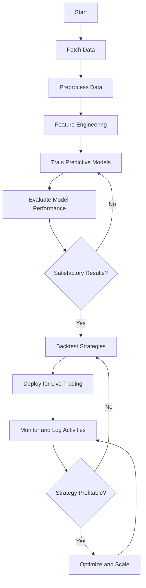

# AI_TRADING
# AI Trading System Documentation

## **Project Overview**
This AI Trading System leverages machine learning models and technical indicators to forecast stock prices, optimize trading strategies, and execute trades automatically. The system is modular, scalable, and integrates seamlessly with the ICICI Direct Breeze API for data retrieval and order execution.

---

## **Features**
- **Data Pipeline**: Fetches, processes, and stores market data from multiple sources.
- **Predictive Models**: Implements time-series forecasting, advanced models (e.g., GANs, Transformers), and ensemble techniques.
- **Strategy Optimization**: Develops and backtests trading strategies using historical data.
- **Execution Services**: Manages live trading, including order placement and position management.
- **Monitoring**: Logs trading activities and monitors system performance.

---

## **Directory Structure**
```
AI-Trading-System/
├── config/                   # Configuration files (e.g., API keys, settings)
├── data/                     # Data storage and processing
├── deploy/                   # Deployment scripts for live trading
├── models/                   # Machine learning models
├── preprocessing/            # Data preprocessing utilities
├── services/                 # Core services for data, strategy, and execution
├── strategies/               # Trading strategies
├── tests/                    # Unit and integration tests
├── utils/                    # Helper utilities (e.g., logging, metrics)
├── README.md                 # Documentation
└── requirements.txt          # Project dependencies
```

---

## **Getting Started**

### **1. Prerequisites**
- Python 3.8+
- Conda environment
- Access to the ICICI Direct Breeze API

### **2. Installation**
1. Clone the repository:
   ```bash
   git clone https://github.com/rock5xax/AI-Trading-System.git
   cd AI-Trading-System
   ```
2. Set up the environment:
   ```bash
   conda create --name ai_trading python=3.8 -y
   conda activate ai_trading
   pip install -r requirements.txt
   ```
3. Configure API keys in `.env`:
   ```
   BREEZE_API_KEY=<your_api_key>
   BREEZE_SECRET_KEY=<your_secret_key>
   ```

---

## **Usage**

### **1. Fetch Data**
Run the data-fetching script to retrieve historical or live data:
```bash
python services/data_service/src/main.py
```

### **2. Train Models**
Train the predictive models using preprocessed data:
```bash
python models/predictive_model.py
```

### **3. Backtest Strategies**
Test your strategies on historical data:
```bash
python utils/backtest.py
```

### **4. Deploy for Live Trading**
Start the live trading bot:
```bash
python deploy/trading_bot.py
```

---

## **Detailed Flowchart**
Below is a detailed flowchart outlining the workflow for this AI Trading System:



---

## **Configuration**
- **Environment Settings**: Stored in the `config/` directory and `.env` file.
- **API Integration**: Configured via `services/data_service/src/breeze_connector.py`.

---

## **Mathematical Calculations**

### **1. Predictive Modeling**
- **Time-Series Models**:
  - ARIMA: Models data as a linear combination of past values and errors:
    \[
    y_t = c + \phi_1 y_{t-1} + \dots + \phi_p y_{t-p} - \theta_1 \epsilon_{t-1} - \dots - \theta_q \epsilon_{t-q} + \epsilon_t
    \]
  - Prophet: Combines trend, seasonality, and holiday effects:
    \[
    y(t) = g(t) + s(t) + h(t) + \epsilon_t
    \]

- **Fourier Transform in Feature Engineering**:
  - Decomposes time-series data into frequency components:
    \[
    F(k) = \sum_{n=0}^{N-1} f(n) e^{-2\pi i kn / N}
    \]
    Used to identify cyclical patterns in stock prices and enhance model inputs.

- **GANs for Advanced Modeling**:
  - Loss function to minimize:
    \[
    \min_G \max_D \mathbb{E}_{x \sim P_{data}(x)}[\log D(x)] + \mathbb{E}_{z \sim P_z(z)}[\log(1 - D(G(z)))]
    \]

### **2. Backtesting Metrics**
- **Sharpe Ratio**:
  \[
    SR = \frac{R_p - R_f}{\sigma_p}
  \]
  where \(R_p\) is portfolio return, \(R_f\) is risk-free rate, and \(\sigma_p\) is standard deviation.

- **Maximum Drawdown**:
  \[
    MDD = \min_t \left( \frac{V_t - V_{peak}}{V_{peak}} \right)
  \]

- **Win/Loss Ratio**:
  \[
    WLR = \frac{\text{Number of Winning Trades}}{\text{Number of Losing Trades}}
  \]

- **Profit Factor**:
  \[
    PF = \frac{\text{Gross Profit}}{\text{Gross Loss}}
  \]

---

## **Testing**
Run all unit and integration tests:
```bash
pytest tests/
```

---

## **Contributing**
Contributions are welcome! Please follow these steps:
1. Fork the repository.
2. Create a new branch:
   ```bash
   git checkout -b feature-name
   ```
3. Commit your changes:
   ```bash
   git commit -m "Add feature description"
   ```
4. Push to the branch:
   ```bash
   git push origin feature-name
   ```
5. Open a pull request.

---

## **License**
This project is licensed under the MIT License. See the LICENSE file for details.

---

## **Acknowledgements**
- [ICICI Direct Breeze API](https://github.com/Idirect-Tech/Breeze-Python-SDK)
- Contributors and the open-source community.

